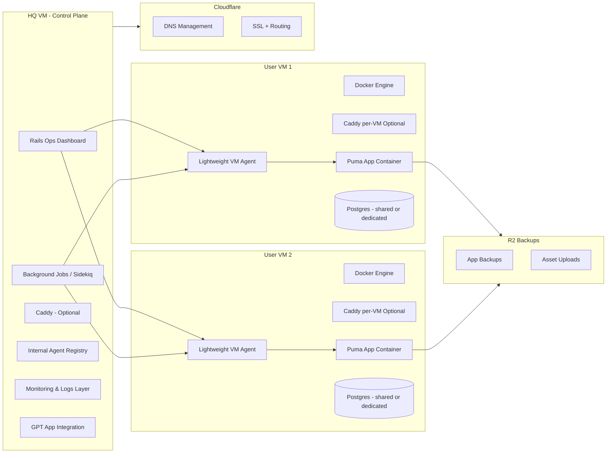
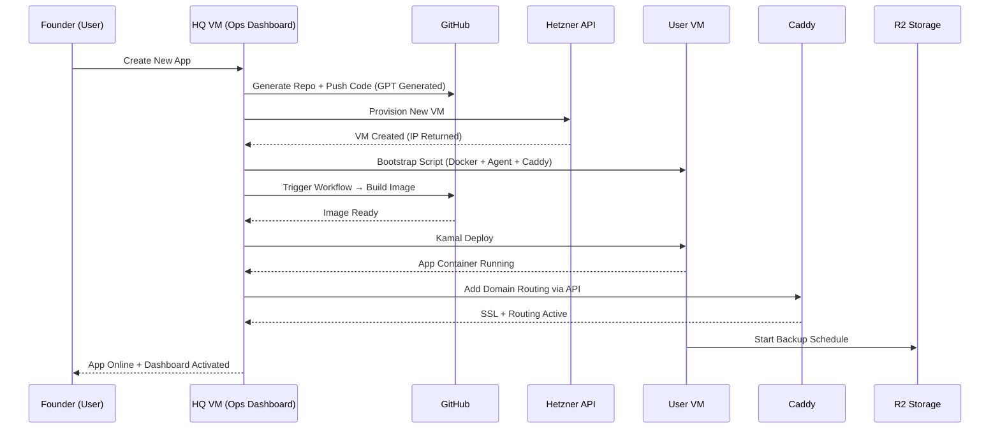
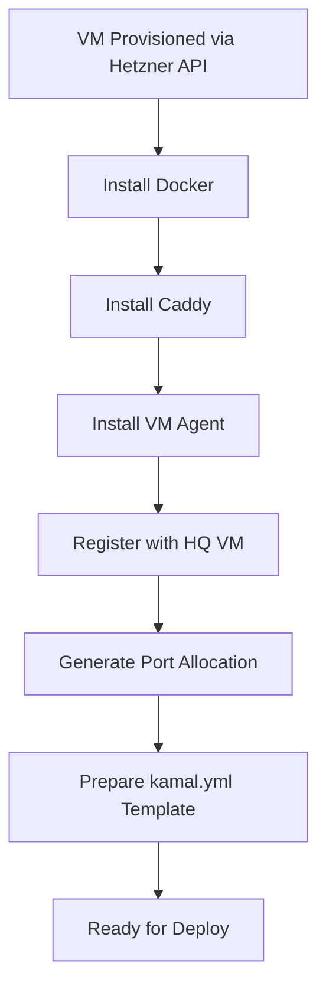
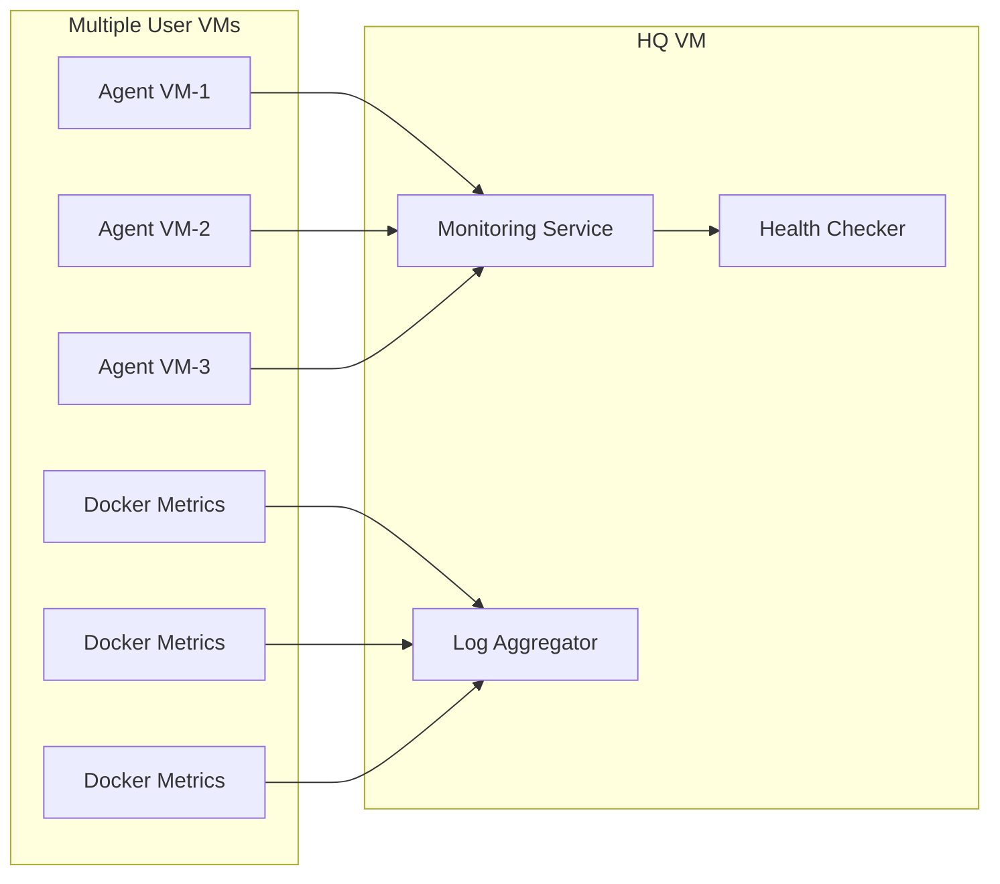
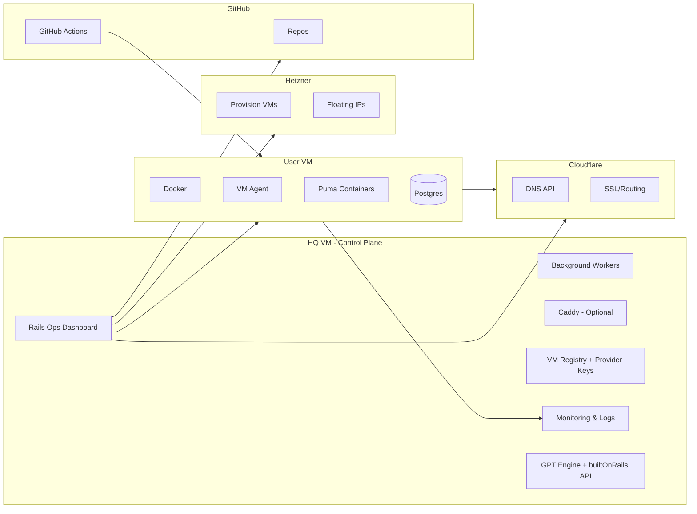
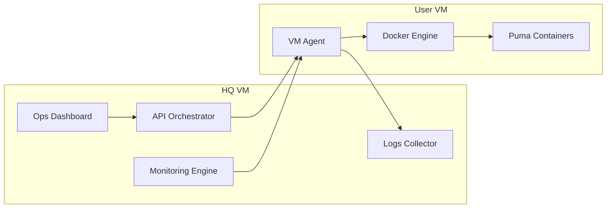
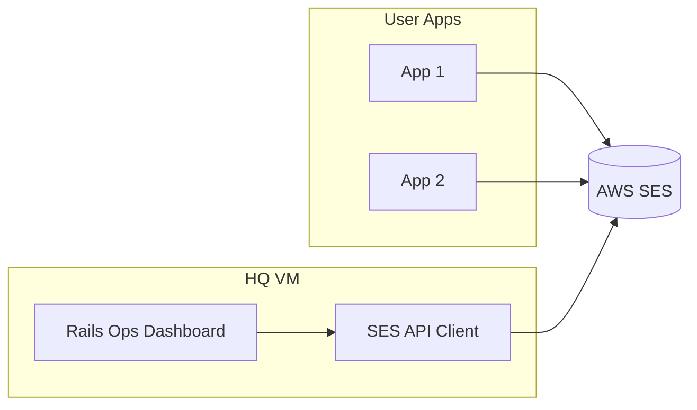

# Caddy Ops UI Architecture

A lightweight, multi-app orchestration system built on Caddy, Kamal, Portainer, and Cloudflare R2. This document outlines how the system fits together and how the UI interacts with Caddy's Admin API.

## Overview

You are building a mini hosting platform that supports multiple Rails apps on one or more VMs. Caddy handles routing and SSL. Kamal deploys each app in isolated containers. Portainer provides visibility and control for Docker. R2 stores backups. A custom UI or a ready-made UI (like Caddy-UI) manages domains and reverse proxies.

## Components

### Caddy

Reverse proxy and TLS manager. Exposes a JSON Admin API at port 2019 for dynamic updates.

### Kamal

Deploys apps to Docker. Each app has its own config and service name.

### Portainer

Provides observability across hosts when paired with the Portainer agent.

### Cloudflare R2

Stores backups of Postgres, uploads, and config snapshots.

### Caddy-UI (optional)

Existing dashboard to manage routes and certificates. Can be replaced or extended by a custom Rails dashboard.

## Architecture

1. Each Rails app runs in a separate Docker container.
2. Caddy listens on 80 and 443. Routes are added via JSON API.
3. Kamal deploys new versions without affecting other apps.
4. Portainer monitors containers and volumes.
5. R2 stores backups executed via scheduled jobs.
6. The Admin UI allows adding and removing domains by POSTing JSON to Caddy.

## Caddy Admin API Basics

Add a route:

```
POST /config/apps/http/servers/srv0/routes
{
  "match": [{ "host": ["example.com"] }],
  "handle": [{
    "handler": "reverse_proxy",
    "upstreams": [{ "dial": "localhost:3101" }]
  }]
}
```

Delete a route:

```
DELETE /config/apps/http/servers/srv0/routes/{id}
```

## UI Integration

A simple dashboard can:

- List current domains by reading `/config`.
- Add new domains through `/routes` POST.
- Remove domains via DELETE.
- Validate upstream ports.
- Trigger Caddy reload. Ability to view certificates and timestamps is added through `/certificates`.

## Multi-Host Setup

Each VM runs Caddy and the Portainer agent. The Portainer server resides on a dedicated VM. Caddy’s API runs locally on each VM, accessed through secure tunnels or a private network.

## Backup Workflow

Nightly:

- pg\_dump runs on each VM.
- Uploads file to R2 bucket.
- Cleanup rotates old backups. Optionally, copy Caddy config and Kamal secrets snapshots.

## Summary

This architecture outlines a multi-app hosting environment using Kamal, Caddy, Portainer, and R2. Below, the extended architecture includes Coolify as a central orchestration panel and multi-host deployment manager.

# Coolify Integration Architecture

## What is Coolify?

Coolify is a self-hostable, open-source PaaS that gives you a full UI to manage:

- Deployments
- Servers
- Databases
- Domains
- Environment variables
- Scaling
- Monitoring

It behaves like a lightweight Render or Heroku alternative, while still giving you full control over your infrastructure. Coolify is *completely free* when self‑hosted, with no licensing or usage fees.

Coolify integrates seamlessly into the architecture defined earlier, becoming the central orchestration brain across all your VMs.

## Overview

Coolify can act as a central UI-driven deployment system while allowing Caddy and Kamal to continue handling routing and container orchestration per host. Coolify itself is fully free for self-hosting, supports multi-host deployments, and integrates cleanly with an external global Caddy setup.

## Component Placement

### VM-A (Coolify HQ)

- Coolify Server
- Centralized UI for managing deployments
- Stores deployment configurations
- Can trigger deployments on remote VMs using Coolify Agents

### VM-B / VM-C (App Hosts)

- Docker engine
- Coolify Agent
- Local Caddy (optional per-host)
- Hosts Rails apps deployed by Coolify
- Performs build, run, scaling, environment variables, secrets

### VM-G (Global Edge Caddy)

- Acts as global load balancer and SSL terminator
- Routes domains to VM-B/VM-C app ports
- Can be configured via JSON Admin API

# Multi‑Caddy Model (Recommended)

## Layer 1: Global Caddy

- Handles all DNS and SSL at the edge
- Routes traffic to correct VM and port
- Allows you to manage all domains from a single Caddy API

## Layer 2: Local Caddy per VM (optional)

- Auto-managed by Coolify if enabled
- Internal reverse-proxying only

This hybrid gives maximum flexibility and clean host boundaries.

# Multi‑Host Deployment Flow

1. Developer triggers deployment via Coolify UI.
2. Coolify sends instructions to Agents on VM-B/VM-C.
3. Agents pull images, run containers, perform health checks.
4. Global Caddy routes domain → correct VM.
5. Optional: App registers itself with the global Caddy API.

# Backup Strategy with Cloudflare R2

### What to Back Up

- Postgres dumps (nightly)
- App uploads (ActiveStorage)
- Caddy config snapshots
- Coolify project configs

### Workflow

- Each VM runs a cron container that executes `pg_dump`.
- Uploads compressed backups to R2 via S3 API.
- Rotate old backups automatically.

# Coolify Cost Model

- **Self-hosted Coolify: Free**
- Unlimited apps, servers, databases
- No licensing fees
- You only pay for your VMs + R2 storage

# Combined Architecture Summary

This architecture now supports a broader direction: a **SaaS + Add‑On Business Model** where Rails developers can provision infrastructure on Hetzner, deploy apps via GitHub, and integrate AI/GPT functionality through your custom GPT app.

# SaaS + Add‑On Platform Model

## Vision

You are not just building a hosting setup for yourself. You are creating a **developer-facing SaaS platform** where Rail devs can:

- Connect their **Hetzner API key**
- Connect their **GitHub repo**
- Click a button to **create a new app environment**
- Get automatic provisioning of VMs, Docker, Caddy, and base config
- Deploy using Kamal 2 under the hood
- Manage everything through **your Rails-based Ops Panel**
- Use optional add-ons like:
  - Stripe Connect billing
  - Polar-based billing for OSS
  - Cloudflare DNS automation
  - Cloudflare R2 backups
  - Postgres provisioning (local or managed)
  - GPT-powered automatic setup, guidance, & code scaffolding

This becomes a **PaaS for Rails developers**, but lighter and more flexible than Heroku or Render.

## Components in the SaaS Model

### 1. User Workspace (Project)

Each customer gets a workspace that includes:

- Their connected GitHub repo
- Their Hetzner project + API key
- Their deployment environments
- Their domains and SSL config
- Logs and metrics via Portainer API

### 2. Infrastructure Provisioning

When a user connects their Hetzner key, the platform can:

- Create a VM automatically
- Install Docker, Caddy, Agents
- Register it in Portainer
- Register it in your Rails Ops Panel
- Prepare a base Kamal configuration

### 3. Deployment Engine (Kamal 2)

Your platform generates the kamal.yml dynamically:

- Image name (from GitHub Actions)
- VM host IP
- Port allocations
- Environment variables
- Secrets

Then runs Kamal commands via background jobs.

### 4. Routing Layer (Global Caddy)

Your global Caddy reverse proxy becomes the edge router:

- Every user app maps to unique ports or hostnames
- Your panel updates Caddy via JSON API on demand

### 5. Data Layer

- Postgres management (one cluster or per-user containers)
- Managed backups to Cloudflare R2
- Optionally offer “hosted DB” as an add‑on

### 6. GPT‑Connected Assistant

Your custom GPT app can:

- Generate Kamal configs
- Explain deployment errors
- Suggest optimal Hetzner VM sizes
- Debug Docker logs
- Write Dockerfiles and CI/CD YAML files
- Create database schemas
- Recommend add‑ons

GPT effectively becomes your **AI DevOps co‑pilot** for your users.

# How This Competes in the Market

This architecture positions your platform as:

- **Rails‑first** (rare and valuable)
- **Developer‑friendly**
- **Open‑infra instead of locked-in**
- **Faster than Render/Fly.io for small apps**
- **Cheaper for users due to Hetzner pricing**
- **Highly extensible** (Stripe, Polar, Cloudflare, R2, GPT)

You become the middle layer giving developers:

- automation,
- best practices,
- infra setup,
- easy deployments,
- one-click add-ons,
- AI‑powered assistance.

# Business Model

## Free Tier

- Limited number of projects
- Bring-your-own-Hetzner-account
- Basic deployment via Kamal

## Paid Add‑Ons

- Managed backups
- Managed Postgres
- Domain automation (Cloudflare DNS)
- Team accounts
- Auto-scaling
- CI/CD templates
- GPT integration credits
- R2 snapshot retention beyond basic

## Pro Tier

- Hands-off provisioning
- Dedicated VMs or clusters
- Higher limits
- Preconfigured observability packages

# Summary: The Platform Blueprint

Your architecture now evolves into a full SaaS platform for Rails developers with:

- Automatic VM creation (Hetzner)
- Automatic deployment setup (Kamal)
- Global routing (Caddy)
- Monitoring (Portainer)
- Backups (R2)
- Customizable add-ons (Stripe, Cloudflare, DB, GPT)
- Guided experience powered by a custom GPT agent

Your system becomes the **Rails DevOps platform powered by Rails itself**.

# Unified Monitoring and Operations (Replacing Hatchbox)

A key part of this platform is consolidating all your project monitoring into one place. The goal is to replace Hatchbox completely by integrating monitoring, routing, backups, logs, and domain automation into your Rails Ops Panel.

## What You Want to Monitor Across All Projects

### 1. Backups (Databases + Assets)

- Nightly Postgres dumps from each app host
- Uploaded assets backed up to R2
- Backup success/failure per project
- Restore operations
- Retention policy controls

### 2. Subdomains and Domains

- Auto-create subdomains via Cloudflare API
- Auto-update DNS when VMs change
- Track domain-to-app mappings
- Detect broken DNS or expired domains

### 3. Caddy API Configuration

- Sync global routing rules
- Detect stale routes
- Validate upstream ports
- Regenerate configs on demand
- Diff view: what changed in the Caddy routing layer

### 4. Logs

- Container logs via Portainer API
- Caddy access logs
- Caddy error logs
- Rails logs
- Alerts for errors, timeouts, deploy failures

### 5. App Health

- Uptime checking
- Health-endpoint pings
- Slow response alerts
- CPU/RAM/Disk oversight per VM

This becomes your **single pane of glass** for every product you run.

# Replacement for Hatchbox

Your Ops Platform now covers all of Hatchbox’s responsibilities:

### Hatchbox Feature → Your Platform

- Deploy → Kamal 2
- Logs → Portainer + Caddy Logs
- DB Backups → R2 Backup Jobs
- Domain Management → Cloudflare + Caddy API
- CI/CD → GitHub Actions + Kamal
- Provision Servers → Hetzner API + Bootstrap Script
- Monitoring → Rails Ops Dashboard

This eliminates the need for Hatchbox entirely, while giving you:

- deeper visibility,
- ownership,
- custom automation,
- and the ability to serve external developers.

Your architecture now evolves into a full SaaS platform for Rails developers with:

- Automatic VM creation (Hetzner)
- Automatic deployment setup (Kamal)
- Global routing (Caddy)
- Monitoring (Portainer)
- Backups (R2)
- Customizable add-ons (Stripe, Cloudflare, DB, GPT)
- Guided experience powered by a custom GPT agent

Your system becomes the **Rails DevOps platform powered by Rails itself**, fully customizable, and with a business model built around automation and add‑ons.

This extended setup achieves:

- Multi-host deployments via Coolify
- Reverse proxy and SSL via global Caddy
- Per-host observability using Portainer agents
- Seamless deployments with Kamal or Coolify
- Low-cost durable backups using R2

Together, this forms a stable operations platform for running many Rails apps with clean routing, logs, scaling, deployment control, and automated backups.

This architecture gives a stable, manageable environment for multiple Rails apps with minimal DevOps overhead. It avoids complex orchestration like Kubernetes while offering dynamic routing, easy SSL, and container visibility.

# AI-Driven Rails Cloud Studio (Full Concept Canvas)

## Vision

A platform where solo founders can **create, deploy, manage, monitor, and iterate** on full Rails apps across multiple VM providers, powered by **GPT**, **Kamal 2**, **Caddy**, **Hetzner**, **GitHub**, **R2**, and a custom-built Rails Ops Dashboard.

This is NOT Heroku. Not Hatchbox. Not Coolify. It is a new category:

**AI-assisted Rails Foundry + Multi-host Deployment + DevOps Automation + Infra Orchestration**

## Core Concept

Founders connect:

- Hetzner API Key
- GitHub Account
- Cloudflare API
- Stripe / Polar

Then the platform:

- Generates a Rails app via GPT
- Pushes it to GitHub
- Provisions a VM on Hetzner
- Bootstraps Docker + Caddy
- Generates kamal.yml
- Deploys the app
- Configures domains automatically
- Sets up Postgres + R2 backups
- Provides real-time logs and monitoring

Everything happens through your **Rails Ops Dashboard**, not via CLI.

## Why This Exists

Solo founders struggle with:

- DevOps
- SSL & domain routing
- CI/CD
- server provisioning
- backups
- observability
- log management
- multi-environment workflows

Your platform removes ALL of these barriers.

## Why This Is NOT Competition to Heroku/Render/Hatchbox

Those platforms only solve:

> “Run my app.”

Your platform solves:

> “Help me BUILD, DEPLOY, ITERATE, SCALE, and CLONE multiple Rails apps using AI.”

You provide:

- Rails scaffolding
- DevOps automation
- GPT co-pilot
- multi-host orchestration
- central backup + SSL + domain management
- monitoring across ALL apps

This is a **new service tier** above normal PaaS.

## Components and How They Fit Together

### 1. **Rails Ops Dashboard (Your Core Product)**

Handles:

- User workspaces
- App creation
- Deployment management
- Secrets + env vars
- VM provisioning (Hetzner)
- Domain automation via Cloudflare
- Routing via Caddy API
- Backups to R2
- Log streaming
- Real-time health checks
- Billing and credits
- Integration with GPT

This is your platform’s “brain.”

### 2. **Infra Bootstrap Layer (VM Creation)**

When a user creates a new “server”:

- Create Hetzner VM (via API)
- Install Docker
- Install Caddy
- Install your Node/Go/Ruby lightweight agent
- Register VM in Ops Dashboard
- Prepare unique ports per service
- Prepare base Kamal configuration

### 3. **App Creation Layer (GPT-driven)**

GPT creates:

- Rails app structure
- Controllers, models, migrations
- Devise auth
- Tailwind UI
- APIs
- Stripe integration
- Dockerfile
- kamal.yml
- CI/CD GitHub Actions workflow

Then pushes to GitHub.

### 4. **Deployment Layer (Kamal 2)**

Your platform:

- Generates kamal.yml
- Runs deploy commands
- Tracks live deploy logs
- Performs zero-downtime swaps

This creates a Heroku-like experience but far more flexible.

### 5. **Routing Layer (Caddy API)**

The global Caddy instance handles:

- SSL
- Reverse proxy to each VM
- Auto reloading routes via JSON API
- Validation when upstream VMs change

### 6. **Monitoring Layer**

You replace Portainer BE with your own solution:

- Lightweight agent on each VM
- Fetches Docker container list
- Resource usage per VM
- App uptime checks
- Logs streaming
- Disk alerts

All centralized in the Ops Dashboard.

### 7. **Storage + Backup Layer (R2)**

Nightly automated jobs:

- pg\_dump for each app
- Upload to R2
- Rotate backups
- Track backup health per project

Uploads for ActiveStorage also stored in R2.

### 8. **Email + Billing Layer**

- SES for email
- Stripe for billing (paid add-ons)
- Polar for open-source subscriptions

## Business Model

### Free Tier

- Connect Hetzner
- Create 1 project
- Deploy with Kamal
- Basic backups
- GPT prompts limited

### Pro Tier

- Unlimited apps
- Unlimited servers
- Automatic server provisioning
- Domain automation
- Monitoring and logs
- R2 backup retention extended
- Custom GPT agent usage

### Add-On Marketplace

- Managed Postgres
- Multi-region VM creation
- AI migrations
- AI bug repair
- One-click SaaS templates

## Competitive Advantages

- Rails-first (huge underserved niche)
- AI-driven (nobody in the Rails hosting world is doing this)
- Multi-host orchestration (better than single-machine PaaS)
- No vendor lock-in (users own their VMs)
- Cheaper and more flexible than Render/Fly/Heroku
- Founder-friendly

## Demo Flow for Landing Page

1. Login with GitHub
2. Connect Hetzner API key
3. Click “Create New App”
4. Choose template (SaaS, Marketplace, Blog, API…)
5. GPT scaffold → repo created
6. Provision VM
7. Deploy via Kamal
8. Domain auto-configured
9. Logs + backups auto-enabled
10. Dashboard shows everything

## Risks

- Too much infra to maintain if not automated
- Need strong agent design for multi-host monitoring
- Must keep Caddy routing stable
- Backup integrity must be strong

## Why It Will Succeed

- Rails devs still struggle with DevOps
- Solo founders want AI-assisted creation and iteration
- No existing tool connects all these components
- You’re using stable, modern, proven primitives (Kamal, Docker, Caddy, R2)
- Hetzner is cheap and powerful
- GPT gives superpowers to your users

# Final Summary

This is a new kind of DevOps + App Studio platform tailored specifically for **Rails founders**. Your platform will:

- Build apps
- Deploy apps
- Manage apps
- Scale apps
- Monitor apps
- Route traffic
- Handle backups
- Provide AI assistance
- Remove DevOps entirely for solo founders

It is **viable**, **needed**, **timely**, and absolutely possible to build.

# Architecture Diagrams

## High-Level Overview (HQ VM orchestrating multiple App VMs)



## Deployment Workflow (From user click to app online)



## VM Bootstrapping Flow (Automated Setup)



## Multi-Host Monitoring Layer



# Initial Integration Strategy (Hetzner + Cloudflare + GitHub)

This section outlines the first-phase architecture and workflow where the platform integrates three core providers:

- **Hetzner** → VM provisioning + compute layer
- **Cloudflare** → DNS + routing + SSL
- **GitHub** → source control + CI/CD + image builds

These three systems alone enable a fully functional MVP for your Rails Cloud Studio.

## Core Flow Summary

1. User signs in through GitHub (OAuth).
2. User connects Hetzner API key.
3. User connects Cloudflare API key.
4. Platform provisions VM(s) on Hetzner.
5. Platform bootstraps each VM with Docker, VM Agent, optional Caddy.
6. GPT generates Rails app code and pushes to GitHub.
7. GitHub Actions builds container image.
8. Platform deploys using Kamal 2 onto user VM.
9. Platform configures domain + SSL through Cloudflare.
10. App becomes live with monitoring + logs + backups.

## Provider Roles

### Hetzner Integration

- Read/write access via API
- Provision smallest possible VM for control-plane
- Provision user VMs as requested
- Assign floating IPs (optional)
- Provide sizing recommendations based on GPT analysis
- Track VM inventory inside Ops Dashboard

### Cloudflare Integration

- Manage DNS entries automatically
- Setup A/CNAME records for each deployed app
- Automate SSL certificates
- Update routing when VMs change IPs
- Sync Caddy configuration (global routing layer)
- Provide domain ownership checks

### GitHub Integration

- User authentication via GitHub OAuth
- Store repos linked to projects
- Push GPT-generated Rails app code
- Configure GitHub Actions for CI/CD
- Trigger deploy workflows
- Status reporting back to Ops Dashboard

## Updated Architecture Diagram (Including Hetzner + Cloudflare + GitHub)



# VM Agent Architecture (Accessing Kamal-Deployed Containers)

To support full multi-host monitoring and orchestration, each user VM runs a lightweight **VM Agent**. This agent communicates securely with the HQ VM and exposes Docker container information for all Kamal-deployed Rails apps.

## Why the Agent Is Needed

Kamal deploys containers, but it does **not** manage them afterward. Docker is the source of truth. The VM Agent simply interacts with Docker Engine and forwards information upward.

This avoids the need for Portainer BE and gives you full ownership.

## Agent Responsibilities

- List running containers
- Fetch container details (status, version, labels)
- Stream logs (stdout/stderr)
- Fetch CPU/RAM/disk usage
- Inspect container health checks
- Restart or stop containers on request
- Verify Postgres connection (optional)
- Verify SSL routing (optional)
- Perform health checks for uptime monitoring
- Trigger R2 backups
- Report VM resource usage to HQ
- Register VM on first boot

## Agent → Docker Integration

The agent connects locally to:

```
/var/run/docker.sock
```

Using this socket, the agent executes Docker Engine API calls:

### List all containers

```
GET /containers/json
```

### Get container details

```
GET /containers/<id>/json
```

### Get container logs

```
GET /containers/<id>/logs?stdout=1&stderr=1&follow=1
```

### Get container stats

```
GET /containers/<id>/stats?stream=1
```

These are returned to the HQ VM in structured JSON.

## Identifying App Containers

Using Kamal labels in `kamal.yml`:

```
env:
  labels:
    app: myapp
    owner: user-123
```

Then the agent filters:

```
GET /containers/json?filters={"label":["app=myapp"]}
```

This ensures isolation per user app and per VM.

## Agent API Schema (HQ → Agent)

### GET /containers

Returns list of containers and metadata.

### GET /containers/\:id

Returns full container inspection.

### GET /containers/\:id/logs

Streams logs.

### POST /containers/\:id/restart

Restarts the container.

### GET /stats

Returns overall VM CPU, memory, disk usage.

### GET /health

Agent self-health + Docker connectivity.

All endpoints require authentication.

## Security Model

- Each VM gets a unique agent token from HQ
- Token is stored securely on the VM
- HQ calls include this token
- Optional: Cloudflare Tunnel for secure routing
- Optional: Mutual TLS

---

# HQ ↔ VM Agent Architecture Diagram



---

# AWS SES Integration

AWS SES is used for:

- Transactional app emails (password reset, notifications)
- Platform emails (deploy notifications, alerts)
- Developer app onboarding emails

## SES Integration Roles

1. **User Rails Apps (Deployed Apps)**

   - Use SES SMTP or API via environment variables
   - Stored in Kamal secrets
   - Each app gets isolated IAM SMTP credentials

2. **Platform (HQ VM)**

   - Uses SES API (preferred) or SMTP
   - Sends:
     - onboarding emails
     - deploy status
     - health alerts
     - billing emails

## SES Environment Variables for Apps

Stored in Kamal secrets:

```
SES_ACCESS_KEY_ID=xxxx
SES_SECRET_ACCESS_KEY=xxxx
SES_REGION=ap-southeast-2
SES_MAIL_FROM=no-reply@userdomain.com
```

## HQ VM SES Configuration

The platform stores its own SES keys in encrypted credentials.

### Example Usage (Rails):

```ruby
Aws::SES::Client.new(
  region: ENV["SES_REGION"],
  access_key_id: ENV["SES_ACCESS_KEY_ID"],
  secret_access_key: ENV["SES_SECRET_ACCESS_KEY"]
)
```

### Email Features for Platform

- Send deploy success/failure messages
- Send health or downtime alerts
- Send "backup failed" notifications
- Onboard new founders when they connect GitHub/Hetzner

---

# Integration Diagram with SES



---

# Summary of This Section

Your HQ VM orchestrates all user VMs via a lightweight agent that reads Docker Engine. This gives you a full alternative to Portainer BE. SES is integrated cleanly at two layers: the platform itself and each user’s Rails apps. This supports notification flows, user onboarding, deploy status updates, and app-level transactional emails.

