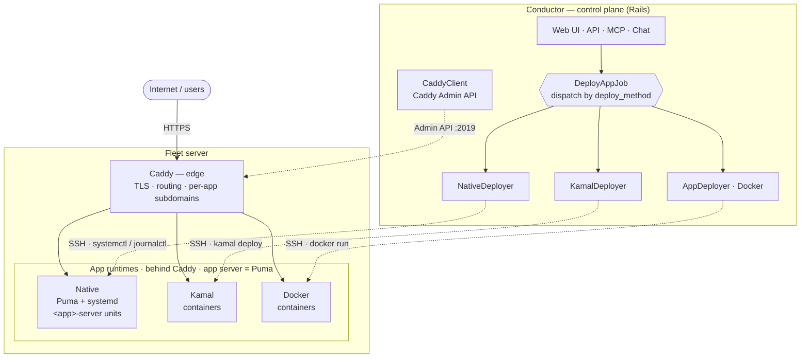
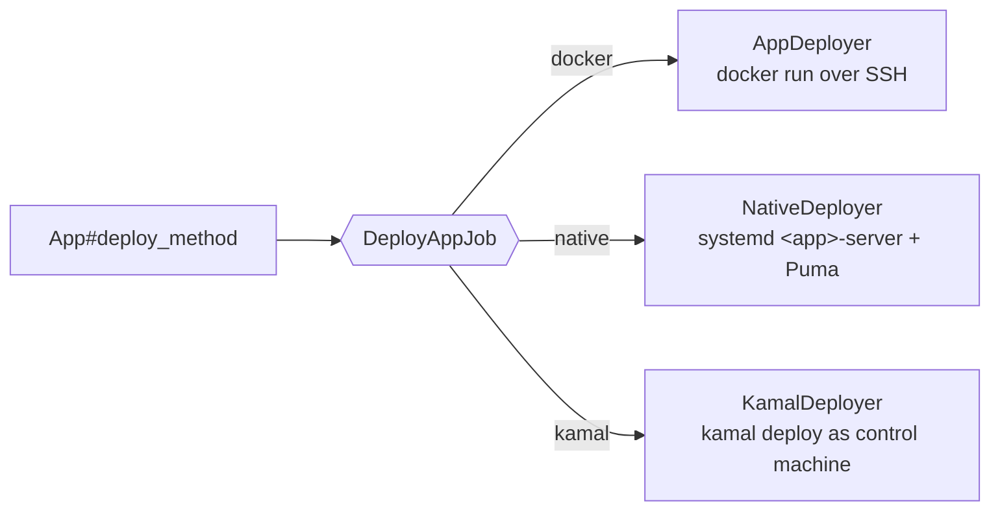
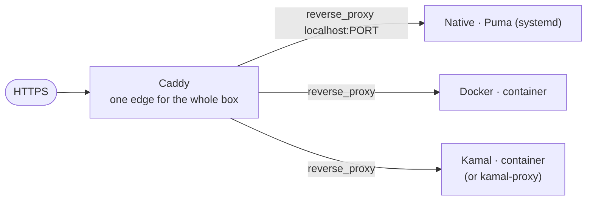

# Conductor Architecture

> **Read this first.** Conductor is a **control plane for self-hosted Rails ops**. It does not invent one deploy path — it manages a **matrix** of them. If you understand this page, the rest of the codebase makes sense.

## The one-paragraph model

Conductor (a Rails app) is the **control plane**. It never runs your app traffic; it *instructs* servers over SSH and manages the edge over an API. On each fleet server, **Caddy is the edge** (TLS, routing, per-app subdomains), and behind Caddy your app runs in one of **three runtimes**. The app server underneath is always **Puma**.

## Three axes (do not collapse them)

| Axis | Options | Where it lives |
|---|---|---|
| **Runtime** (how the app process runs) | **Docker** · **Native** · **Kamal** | `App#deploy_method`; dispatched by `DeployAppJob` |
| **Edge / proxy** (how traffic reaches it) | **Caddy** (standard) · kamal-proxy (Kamal's built-in) | `CaddyClient` (Caddy Admin API) / Kamal `proxy:` |
| **Topology** | **standalone** · **fleet** | `Server` + `App#self_managed` |

The app server is **Puma** in every runtime. "Caddy or Puma" = *edge proxy* (Caddy) in front of the *app server* (Puma) — not an either/or of the same layer.

## System overview

## Deploy dispatch

Every deploy enters through `DeployAppJob`, which picks the deployer by `App#deploy_method`:

## The edge: Caddy is the standard

Conductor standardizes the edge on **Caddy**, driven live via the Caddy **Admin API** (`CaddyClient`, port 2019) — add/remove domains and per-app subdomains without a redeploy. Kamal apps historically front with **kamal-proxy** (the `proxy:` block in `deploy.yml`); the direction (roadmap slot 18) is per-app choice with **Caddy as default across all three runtimes**.

## Control plane vs data plane

- **Control plane (Conductor):** UI/API/MCP/chat → deployers (SSH) + `CaddyClient` (Admin API). Holds fleet state; does **not** serve app traffic.
- **Data plane (fleet servers):** Caddy + the app runtimes. Serves all real traffic. Should keep serving if Conductor is offline.
- Conductor deploys **itself** via GitHub Actions CI (not self-deploy) — see `docs/dev/adr/` and the deploy playbook.

## Cross-cutting principle (applies to all three runtimes)

**The repo is the source of truth; a deploy must be reproducible by hand.** For Kamal that means a real `config/deploy.yml` + `.kamal/secrets` (ADR `docs/dev/adr/0001-self-describing-kamal-deploys.md`). The same principle has runtime-specific analogues for Docker (real run/compose + env) and Native (real systemd unit + env) — an operator with the repo + SSH key should reach the running app without querying Conductor. This is a known gap today (see the self-audit handoff).

## Where to go next
- Runtimes/deployers: `app/services/{kamal,native}_deployer.rb`, `app/services/app_deployer.rb`
- Edge: `app/services/caddy_client.rb`
- Dispatch + single-flight: `app/jobs/deploy_app_job.rb`, `App#start_deployment!`
- Roadmap & decisions: `docs/dev/ROADMAP.md`, `docs/dev/adr/`
