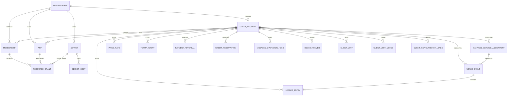

# 01 · Client Access and Managed Billing

**Status:** Approved design — awaiting implementation planning
**Scenario:** [`SC-010`](../scenarios/sc-010-client-access-managed-billing.md)
**HTML companion:** [`01-client-access-managed-billing.html`](./01-client-access-managed-billing.html)

## Outcome

Let the operator host several clients inside one Conductor organization, grant
each person access to all or selected apps/servers, and resell managed backups
and server capacity through a prepaid Stripe-funded wallet.

The first commercial slice proves one complete path:

1. admin creates a client account and assigns apps, servers, and memberships
2. client adds prepaid credit through Stripe Checkout
3. Conductor posts fixed hosting charges and measured backup charges
4. both client and admin can reconcile every balance change
5. low balance follows an explicit policy, defaulting to limited grace

## Product Boundary

The open-source distribution keeps the self-hosted control plane and bring-your-
own infrastructure usable. The hosted operator charges for managed provider
spend, managed server capacity, operational convenience, and support. Core
self-hosting must not be artificially disabled to force payment.

Managed provider accounts ship first. Bring-your-own provider credentials are a
later mode that records operational usage without debiting managed-service
credits.

## Hosted-Instance Admission and Platform Fee

Billing gates run only when `HOSTED_BILLING_ENABLED=true`. It defaults to false,
so an open-source self-hosted installation has no commercial admission gate,
wallet requirement, or platform fee.

The hosted live instance stays invite/admin-approved:

1. unknown sign-in emails do not create users or organizations
2. an access request creates no fleet resource
3. admin approval creates or links a `pending` client account; the requester may
   reach only activation and top-up surfaces
4. a verified initial top-up or an effective, expiring admin waiver atomically
   changes the account from `pending` to `active`
5. every active external client receives one fixed monthly
   `platform_access` client-account charge, regardless of user count

The platform-access rate is client-specific. A `BillingWaiver` may set it to
zero for an internal/beta account only with a reason and expiry. The operator's
own internal organization is explicitly exempt. An expired waiver never renews
silently. The next due `platform_access` event uses the normal recurring-charge
path; if that debit exhausts grace, the normal `past_due` transition applies.

Hosted client limits are explicit policy, not hidden throttles. V1 defines:

- apps and servers as absolute counts of active records
- concurrent jobs and log streams as leases with expiry/heartbeat and explicit release
- backup dispatches as fixed UTC-day buckets `[00:00, next 00:00)`
- API and MCP calls as one combined fixed UTC-minute bucket per client account

Each value is admin-configurable. Fixed-window counters use a unique
`(client_account_id, key, window_start)` row and atomic increment; a new window
creates a new row rather than resetting an old one. Concurrency acquisition
locks the relevant client-limit row and counts unexpired leases. Rejection
happens before queueing work or opening a stream, includes the limit and UTC
reset/lease-expiry time, and never stops existing apps or destroys data.

`HostedAccessPolicy` has one interface: `allows?(membership, action, resource:)`.
It runs after authentication/resource access and before expensive work. It
checks client state, waiver, and the configured absolute/window/concurrency
limit. Monetary operation admission is separately delegated to
`CreditReserver`; no caller reimplements balance or grace arithmetic.
Self-hosted mode returns allow without querying billing tables.

## Actors and Ownership

| Actor / record | Owns |
| --- | --- |
| Platform admin | Client accounts, assignments, internal costs, sell rates, credit policy, adjustments |
| Organization owner | Organization-wide access and existing owner-only capabilities |
| Editor | Existing editor capabilities, narrowed to all or selected resources |
| Member | Existing member capabilities, narrowed to all or selected resources |
| Client account | Commercial relationship, Stripe customer, shared wallet, assigned billable apps/services |
| Stripe | Hosted payment collection and payment receipts; not Conductor's balance authority |
| Conductor ledger | Authoritative, immutable record of credits and debits |

A client account may have several memberships and apps. Billing is never tied
to one login. `App#client_account_id` determines who pays for future managed
usage; membership grants independently determine who may see or operate the app.

## Resource Access Contract

`Membership` gains `resource_scope`:

| Scope | Meaning |
| --- | --- |
| `all` | Unlinked staff: every organization resource. Client-linked user: every resource owned/billed by that client account |
| `selected` | Only explicit grants that also fall inside the membership's organization/client boundary |

Locks:

- Owners are always organization-wide `all` and cannot link to a client account.
- Editors and members may be `all` or `selected`.
- A membership linked to a client account can never reach another client
  account's app, even with `all` or a stale/malicious grant row. The client
  boundary is checked before resource scope.
- An app grant exposes that app, not its entire host server.
- A server grant exposes the server and its hosted apps only when the membership
  is unlinked staff, or the server is dedicated to that membership's client
  account. Client-linked memberships cannot receive a shared/mixed-client
  server grant; they use app grants instead.
- Direct app grants and inherited server grants are additive; v1 has no deny exceptions.
- Role/capability and resource visibility are separate checks. A grant cannot
  turn a member into an editor or let an editor cross an owner-only boundary.
- The same resolver scopes web controllers, API queries, MCP tools, Action Cable
  channels, counts, dashboards, and background-stream subscriptions.
- Moving an app on or off a granted server changes inherited visibility on the
  next authorization check. No copied app-grant rows are created.
- Removing a grant takes effect immediately; existing sessions/tokens do not
  preserve stale resource access.

One `ResourceAccessPolicy` should expose independently testable interfaces:

- `client_boundary` — organization-wide for owners/unlinked staff, one client account otherwise
- `accessible_apps` and `accessible_servers` — composable Active Record scopes
- `allows?(capability, resource)` — role capability AND boundary AND scope
- `billing_visibility` — aggregate wallet plus line-item redaction rules

Callers must not recreate grant joins ad hoc.

## Managed Services and Pricing

### First-slice service keys

| Service key | Unit | Source | Pricing rule |
| --- | --- | --- | --- |
| `backup_operation` | successful operation | Completed backup | Client-specific unit price |
| `backup_storage` | GB-month | Tracked retained artifacts | Client-specific unit price; cannot ship before artifact tracking is trustworthy |
| `hosting_shared_app` | app-month | Active app hosting assignment | Fixed monthly price per app |
| `hosting_dedicated_server` | server-month | Active dedicated server assignment | Fixed monthly price for the whole server |
| `platform_access` | client-account-month | Active hosted client account | One configurable monthly fee, independent of user count |

Shared hosting is not CPU/RAM metering. Resource metrics remain operational
evidence, not the invoice calculation. A shared app and a dedicated server are
mutually exclusive hosting assignments for the same client/resource period.

Hosting is charged in advance at assignment start and on each monthly
anniversary for a half-open billing period. An anchor beyond the end of a short
month clamps to that month's final day. V1 does not automatically prorate
mid-cycle changes or issue automatic partial refunds; admins use an explicit
adjustment entry. This keeps every correction visible.

A dedicated-server assignment requires every non-system `App` hosted on that
server to have the same `client_account_id` as the assignment. A nil/unassigned
or other-client app blocks the assignment regardless of whether it has a
billing assignment. Platform daemons that are not `App` records are the only
exemption. While dedicated billing is active, no app on that server may carry a
shared-app hosting assignment. Creating or moving an app onto the server is
rejected unless it satisfies the same invariant.

### Internal server economics

`ServerCost` versions the operator's internal monthly cost for a server. It is
admin-only and never appears in the client dashboard or API. The admin surface
may compare active shared-app and dedicated-server sell rates against the
effective server cost to show projected gross margin.

Internal cost is analysis data, not a client debit. Client debits come only from
their effective sell rates.

### Rate versioning

Every `PriceRate` belongs to a client account, names a service key and unit, and
has an effective interval. It may target a specific app/server where the client
has a negotiated resource-specific price. Resolution is deterministic:

1. effective resource-specific client rate
2. effective client-wide rate for the service/unit
3. configuration error — hold the charge and alert admin; never silently use zero

Every posted usage event snapshots:

- service key and unit
- measured quantity or fixed billing period
- effective unit price
- total amount in integer minor units
- currency
- billable app/server and client account

Rate lookup uses `occurred_at` for measured events and `period_start` for fixed
monthly events, always in UTC. An event whose currency differs from the client
wallet or selected rate is held as configuration error and never converted.

Changing a rate affects only future events. Historical charges never recalculate.

## Wallet and Ledger

### Currency

Each client account has one currency, defaulting to the deployment's configured
billing currency (`AUD` for the hosted instance). A client account cannot change
currency after its first ledger entry. A ledger never mixes currencies.

### Ledger rules

- `LedgerEntry` values use signed integer minor units, never floating point.
- Posted entries are immutable.
- Entry kinds and signs are explicit: `topup` positive, `service_charge`
  negative, `service_credit` positive, `payment_reversal` negative,
  `payment_reinstatement` positive, and `adjustment` signed with an operator reason.
- Refunding a service charge creates `service_credit`; refunding/reversing a
  Stripe payment creates `payment_reversal`. They are not the same event.
- Balance is the sum of posted entries. A cached balance may exist only as an
  atomically maintained performance projection that can be rebuilt from entries.
- Every external payment and billable event has a unique idempotency key.
- Posting a debit for an existing `UsageEvent` and marking that event `posted`
  is one database transaction; creating the usage fact may happen earlier.
- Every posting transaction locks the client account row before updating any
  cached balance or testing its grace boundary.

### Stripe top-up flow

1. An authorized client-account member chooses an allowed top-up amount.
2. Conductor creates a pending `TopupIntent`, then a Stripe Checkout Session in
   `payment` mode. The intent stores client account, Stripe customer/session,
   amount, currency, and status.
3. Stripe collects payment and redirects the browser to a processing/success page.
4. The endpoint accepts only `checkout.session.completed` and
   `checkout.session.async_payment_succeeded` for credit fulfillment; delayed
   failures mark the intent failed without credit.
5. After signature verification, Conductor retrieves the Checkout Session and
   requires: stored session id, `mode=payment`, paid status, exact Stripe
   customer, exact currency, exact amount total, and metadata/client reference
   matching the pending intent/client account.
6. The stable money idempotency key is `stripe_checkout_session:<session_id>`,
   not the Stripe Event id, because separate event objects may describe one payment.
7. One transaction locks the client account, posts `topup`, and marks the intent credited.

`refund.created`, `refund.updated`, and `refund.failed` update a durable
`PaymentReversal` record after retrieving the Refund. A pending refund does not
change wallet balance. Only Stripe status `succeeded` posts an idempotent,
possibly partial `payment_reversal` tied to the original top-up, using
`stripe_refund:<refund_id>:succeeded`. A failed/cancelled refund posts nothing;
if a reversal was already posted before a later contradictory terminal event,
Conductor defensively appends one `payment_reinstatement` using
`stripe_refund:<refund_id>:reinstated` and alerts admin. Dispute-funds-withdrawn
and dispute-funds-reinstated use the same append-only reversal/reinstatement
rule. These events may take the wallet into grace/hold state; they never rewrite
the original top-up.

Invalid signatures return `400`. Verified but unsupported event types return
`200` without mutation. A verified event with mismatched customer, currency,
amount, session, or intent is stored as rejected, alerts admin, and returns `200`
so Stripe retries cannot become an alert storm.

The browser return page never grants credit. Stripe secrets, payloads, and
payment details must not appear in application logs. Hosted Checkout keeps card
data out of Conductor.

## Usage and Charge Flows

### State and transaction boundaries

`UsageEvent` is an immutable billable fact with
`pending_charge | posted | held | voided`. It is allowed to survive without a
ledger entry. Its creation resolves and stores one authoritative price snapshot.
For a pre-authorized operation, that snapshot must be copied from its reservation
and is never re-resolved when the operation completes. Posting locks the client
account, uses the event's stored amount/currency, creates one ledger entry, and
changes the event to `posted` in a single transaction. A
unique `(client_account_id, service_key, source_key, period_start)` constraint
prevents duplicate logical events; the ledger also uniquely references a usage
event.

`CreditReservation` protects pre-authorized variable operations from concurrent
grace overspend. Reservation creation locks the client account and counts posted
balance minus open reservations. States are
`reserved | consumed | settled | released | denied | expired`. A consumed
reservation still reduces spendable credit until its durable usage fact is
posted or explicitly reconciled.

`ManagedOperationHold` persists denied work with resource, operation, source
schedule/request, reason, required credit, and `held | resumed | cancelled`
state. A top-up or admin override can explicitly resume it. The original
schedule key prevents resuming the same held operation twice.

Accrued/contractual charges—platform access, monthly hosting, and storage already
consumed—are not optional work and do not disappear under `hold`. They post to
the ledger, can move the account beyond grace into `past_due`, and then prevent
new reservable managed work. Existing apps continue running.

### Backup

1. Scheduled/manual dispatch resolves the app's client account, effective
   operation rate, and credit policy.
2. Conductor locks the client account and reserves the exact fixed operation
   price against balance plus grace. If denied, it persists a resumable hold.
3. A reserved backup runs against the managed provider. Failure releases the
   reservation and creates no operation charge.
4. Successful backup completion atomically creates one `pending_charge`
   operation `UsageEvent` with the reserved price snapshot and changes the
   reservation from `reserved` to `consumed`.
5. `UsageChargePoster` later locks the account and, in one retry-safe
   transaction, posts the debit, marks the event `posted`, and changes the
   reservation from `consumed` to `settled`. A posting failure therefore leaves
   a durable billable fact and still-reserved credit.
6. When retained artifact inventory is reliable, a daily retained-byte snapshot
   feeds monthly storage aggregation: sum GB-days divided by the number of days
   in that billing period. It emits a separate GB-month event.
7. Storage is accrued usage: it posts even when the resulting account becomes
   past due; new reservable work is then held.

A provider or charge-posting failure does not rewrite a successful backup as
failed. The backup and billing states remain separate so billing can retry safely.

Storage billing is excluded from the first executable implementation plan. It
may activate only after a separate artifact-accounting plan proves all of:

- every completed remote backup has a persisted provider/bucket/object key
- lifecycle state distinguishes retained, expired, deletion-pending, and deleted
- a daily provider reconciliation reports zero unexplained objects/missing rows
  for 30 consecutive days in shadow mode
- retention deletion failures remain visible and billable bytes use retained
  provider truth rather than only database rows
- the GB-day aggregation above reproduces a fixture/provider inventory exactly

### Managed server space

1. Admin assigns either shared app hosting or a dedicated server to the client.
2. The assignment records its start date and billing anniversary.
3. At assignment start and each monthly anniversary, the billing job emits one
   fixed-period usage event for `[period_start, period_end)`.
4. The event snapshots the effective app-month/server-month price and posts one debit.
5. Duplicate or retried jobs reuse the period-specific idempotency key.

Moving an app to another physical server does not change its shared app sell
price unless the admin changes the rate. A dedicated-server assignment must be
ended or transferred explicitly when the client no longer controls that server.

### Hosted platform access

The same fixed-period path posts `platform_access` in advance at client-account
activation and each monthly anniversary. An active waiver emits no zero-value
ledger row; the dashboard shows the waiver and expiry. An expired waiver makes
the next period chargeable. User count never changes the rate.

## Credit Policy

Each client account has admin-configurable:

- insufficient-credit behavior: `grace` or `hold`
- grace limit in minor units
- low-balance notification threshold

Default behavior is limited grace. A billable operation that stays within the
grace limit reserves and runs. Balance and open reservations are tested while
holding the client-account row lock, so concurrent operations cannot each spend
the same grace. When a new reservation would exceed the limit, Conductor
persists a resumable hold and visibly alerts the client and admin; it never
silently discards a scheduled backup.

Contractual monthly and already-accrued charges still post and may move the
account beyond grace. That transition sets `past_due` and blocks new reservations
but does not erase or hide the obligation.

Exhausting credit does not automatically stop a running app, destroy data,
revoke dashboard access, or suspend a server. Service suspension is a deliberate
admin action outside v1.

## Product Surfaces

### Client dashboard

- available credit, grace remaining, low-balance/past-due state
- Stripe top-up action and processing state
- assigned apps and any explicitly visible servers
- monthly hosting and backup charges by app/service
- backup freshness/verification without unrelated fleet data
- immutable recent ledger activity and export

Any membership linked to the client account may view the aggregate wallet and
add credit. The full financial total is shared because the wallet is shared.
Detailed ledger rows for accessible resources show the resource name and link;
rows for ungranted resources are grouped as “other managed services” by service
and period, with no app/server identifier or operational link. Platform admins
see unredacted detail. V1 has no stored-payment-method management in Conductor,
so top-up permission does not expose card details.

### Platform-admin client account

- create/archive client accounts and link memberships/apps
- set membership scope and app/server grants
- record internal server-cost versions
- assign shared app or dedicated server hosting
- create future-effective client rates
- configure grace and low-balance policy
- post explicit adjustments, service credits, or payment reversals with an operator reason
- inspect margin, Stripe identifiers, usage events, and ledger history

Clients cannot see internal server cost, margin, another client's rates, or
admin adjustment controls.

## Client Lifecycle

States are `pending | active | past_due | archived`.

- `pending`: no hosted operations; may use only approved activation/top-up surfaces.
- `active`: admission, limits, assignments, and credit policy apply normally.
- `past_due`: billing history and top-up remain available; new reservable
  managed work is held; existing apps and accrued monthly charges continue.
- `archived`: Checkout and new charges are disabled, resource grants stop
  authorizing client-linked memberships, and clients receive read-only billing
  history/export. Admin retains full audit access.

Archival is rejected while assignments, reservations, or held operations remain
active. Admin must end/cancel them explicitly, so no work silently disappears.
Historical rates, usage, and ledger entries stay immutable.

`ClientAccountActivator` is the only `pending -> active` transition. It locks
the account and requires either a positive posted ledger balance or an
effective waiver. Stripe browser redirects and unverified payment state cannot
activate an account.

`ClientAccountStateReconciler` is the only `active <-> past_due` transition. It
runs transactionally after every posted ledger change and every reservation
state change that adds or removes a `reserved`/`consumed` amount, including
reserve, consume, settle, release, deny, expire, and cancel paths. It defines
spendable credit as posted balance plus the configured grace limit minus all
`reserved` and `consumed` reservations. A value below zero moves
`active -> past_due`; a value at or above zero moves `past_due -> active`.
Top-ups, reinstatements, service credits, adjustments, and released/expired
reservations can therefore recover the account deterministically.
Renewing a waiver changes future platform charges but never erases an already
posted debit; an admin must append an explicit service credit if forgiveness is
intended.

Changing `App#client_account_id` must go through one assignment service. In a
single transaction it ends old future service assignments, revokes the old
client boundary, validates dedicated/shared-hosting constraints, and records the
effective transfer time. Usage before that instant remains with the old client;
usage at/after it uses the new client. New client access is never granted
automatically.

## Data Model

| Entity | Important fields / constraints |
| --- | --- |
| `ClientAccount` | `organization_id`, `name`, `stripe_customer_id`, `currency`, `status`, `credit_policy`, `grace_limit_cents`, `low_balance_cents` |
| `TopupIntent` | client, session/customer, amount/currency, pending/credited/failed/rejected, unique Stripe session |
| `PaymentReversal` | client, original top-up, Stripe refund/dispute reference, amount/currency, provider status, reversal/reinstatement ledger references |
| `Membership` | optional `client_account_id`, `resource_scope`; owner requires `all` |
| `ResourceGrant` | `membership_id`, resource type/id; unique per membership/resource; same-organization validation |
| `App` | optional `client_account_id`; same-organization validation |
| `ServerCost` | `server_id`, `monthly_cost_cents`, `currency`, effective interval; intervals may not overlap |
| `ManagedServiceAssignment` | client, app/server target, service key, status, start/end, billing anchor; prevents conflicting hosting assignments |
| `PriceRate` | client, optional resource target, service key, unit, unit price, effective interval; intervals may not overlap at the same specificity |
| `UsageEvent` | client, app/server, assignment, service key, quantity, unit, price snapshot, amount, period/provider reference, unique idempotency key |
| `LedgerEntry` | client, optional usage event, explicit signed kind, amount, currency, external reference, operator reason, unique idempotency key |
| `CreditReservation` | client, operation/source key, price snapshot, amount/currency, reserved/consumed/settled/released/denied/expired |
| `ManagedOperationHold` | client, resource/operation/source key, required credit, held/resumed/cancelled, unique resume key |
| `BillingWaiver` | client, service key, reason, starts/ends; internal/beta only, expiry required |
| `ClientLimit` | client, key, integer value, `absolute | concurrent | fixed_minute | fixed_day`; hosted mode only |
| `ClientLimitUsage` | client, limit key, UTC window start/end, atomic count; unique per client/key/window start |
| `ClientConcurrencyLease` | client, limit key, source key, acquired/heartbeat/expiry/released timestamps; unique live source lease |

## Failure Handling

| Failure | Required behavior |
| --- | --- |
| Stripe payment complete; webhook late | Show processing; do not grant credit until verified webhook |
| Duplicate Stripe webhook | Return success and reuse the existing top-up entry |
| Mismatched paid Checkout Session | Record rejection, alert admin, post no credit |
| Stripe refund pending/fails | Track provider state; mutate no balance until succeeded |
| Stripe refund/dispute succeeds | Append one negative payment reversal; keep original top-up immutable |
| Reversed payment is reinstated | Append one positive reinstatement and alert; never edit the reversal |
| Backup succeeds; ledger posting fails | Preserve successful backup and usage fact; retry debit idempotently |
| Concurrent backup dispatches near grace | Client row lock + open reservations allow only affordable operations |
| Held backup after top-up | Resume explicitly from persisted hold; unique source key prevents duplicate run |
| Hosting billing job retries | Reuse client/service/period key; exactly one monthly debit |
| Rate changes during pre-authorized work | Reservation/event snapshot remains authoritative; posting never re-resolves it |
| Missing/ambiguous rate | Hold event as configuration error; alert admin; never post zero |
| App changes client | Future usage follows new client; historical events and ledger entries stay put |
| App moves between servers | Server-grant visibility recalculates from current placement |
| Grant removed during a live session | Next web/API/MCP/stream check denies the resource |
| Grace exhausted | Hold new managed operation, alert both parties, keep existing apps/data intact |
| Client archived with active work | Reject archival until assignments/reservations/holds are explicitly closed |

## Verification Contract

Implementation planning must include tests proving:

1. owner/unlinked/client-linked editor/member × `all`/`selected` visibility across web, API, MCP, and streams
2. shared-server grants are rejected for client-linked memberships; dedicated
   server grants include only same-client apps while app grants do not reveal the server
3. app movement changes inherited visibility and grant removal is immediate
4. cross-organization grants, client links, prices, costs, and entries are rejected
5. valid, duplicate, delayed, unsupported, mismatched, refunded, disputed, and
   reinstated Stripe events produce the exact intended entry or rejection
6. ledger balance equals the sum of entries under concurrent top-ups, charges,
   reservations, grace checks, reversals, and reinstatements
7. historical rate snapshots survive rate changes and app/client reassignment
8. app/client transfers plus nil-client, mixed-client, or double-billed dedicated assignments are rejected or transition atomically
9. UTC monthly platform/hosting charges post once per period, clamp
   short-month/leap-day anchors, end cleanly, and do not auto-prorate
10. backup-operation events retry independently; storage charging is absent
    until its separate readiness gate passes
11. grace/hold thresholds behave at exact boundary values
12. client views never expose internal server costs, margins, other clients, or ungranted resources
13. detailed wallet rows redact ungranted resource identities while totals remain correct
14. held operations resume once, archive requires explicit close-out, and
    self-hosted mode bypasses every hosted commercial gate
15. missing/ambiguous/currency-mismatched rates hold and alert without posting
16. absolute counts, UTC minute/day buckets, and expiring concurrency leases
    reject new work at exact boundaries without affecting running apps

## Executable Plan Boundaries

This file is the cross-surface program contract, not one implementation plan.
Write and approve six implementation plans; each plan must ship and verify its
interface before the next consumer begins:

| Plan | Owns | Published interface / invariant |
| --- | --- | --- |
| A · Resource access | client identity/boundary, membership scope, grants, query scopes | `ResourceAccessPolicy`; no caller writes its own grant join |
| B · Wallet and Stripe | wallet, top-up intents, activation funding fact, webhooks, immutable ledger | `Wallet#balance`, `LedgerPoster`, Stripe attribution/idempotency |
| C · Rates and recurring services | rate resolver, server costs, assignments, platform/hosting UTC periods | `RateResolver`, `RecurringChargeEmitter`; one event per period |
| D · Hosted admission | lifecycle activation, platform waiver, absolute/window/concurrency limits | `ClientAccountActivator`, `HostedAccessPolicy`; consumes A–C and self-host bypass is total |
| E · Backup operation billing | reservations, holds, successful-operation usage facts | `CreditReserver`, `UsageChargePoster`; success consumes then settles a reservation |
| F · Product surfaces and hardening | client/admin UI, redaction, notices, export, cross-surface tests | dashboards consume policies/ledgers without bypassing interfaces |

Plan A is the only next implementation-planning target after this spec is
approved. Backup storage is a later separate artifact-accounting plan, not part
of Plan E. Do not begin SES/SNS metering until A–F reconcile end to end.

## Deferred

- SES and SNS managed-usage events (next integrations on the same ledger)
- bring-your-own provider credentials
- automatic top-up
- CPU/RAM/disk-based hosting prices
- automated proration and partial refunds
- automatic service suspension or app shutdown
- tax calculation and Conductor-issued tax invoices
- multi-currency wallets
- per-user hosted platform pricing

Stripe receipts may support a private beta, but public paid launch requires the
operator to lock tax/invoice policy with appropriate accounting advice.

## Decision Record

- **D-01-1:** One organization may contain multiple clients; do not create an organization per client.
- **D-01-2:** Owners are organization-wide; editors and members may be `all` or `selected`, bounded by linked client account.
- **D-01-3:** Staff server grants include hosted apps; client-linked server grants require a same-client dedicated server. App grants do not include the server.
- **D-01-4:** One wallet belongs to a client account shared across its users/apps.
- **D-01-5:** Managed providers ship first; BYO is later.
- **D-01-6:** Stripe prepays an immutable Conductor ledger; no negative invoice balance model.
- **D-01-7:** Insufficient credit defaults to limited, admin-configurable grace.
- **D-01-8:** Backup is the first metered provider integration.
- **D-01-9:** Shared server space is fixed per app-month; dedicated space is fixed per server-month.
- **D-01-10:** Hosting is not CPU/RAM usage billing in v1.
- **D-01-11:** Client-specific prices are versioned and snapshotted per event.
- **D-01-12:** Hosting bills in advance per assignment period; v1 adjustments replace automated proration.
- **D-01-13:** Dedicated hosting cannot overlap shared-app charges or cover a mixed-client server.
- **D-01-14:** Hosted access is one configurable client-account-month fee; internal/beta waivers require expiry.
- **D-01-15:** Client-linked `all` stops at the client boundary; shared-server grants are staff-only.
- **D-01-16:** New variable work reserves credit atomically; accrued monthly/storage obligations still post.

## Visual References

- [Architecture](https://kuickr.co/conductor/brainstorm/client-billing-architecture.html)
- [Wallet and ledger](https://kuickr.co/conductor/brainstorm/client-billing-ledger.html)
- [Client and admin dashboards](https://kuickr.co/conductor/brainstorm/client-billing-dashboards.html)
